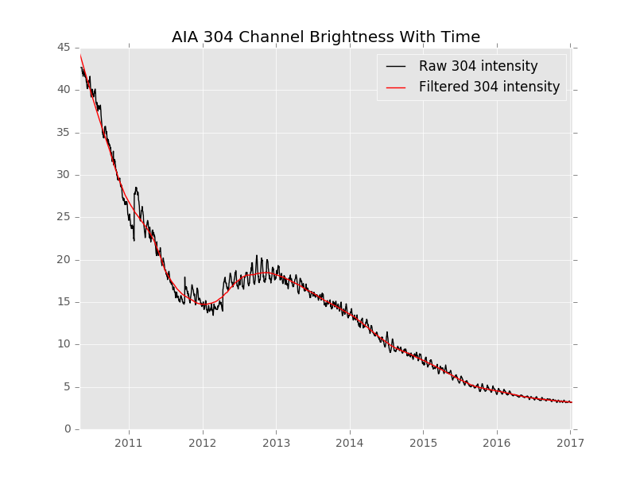

# aia
Place for sharing python code written for doing things with AIA data.

## Sun Intensity

The SunIntensity package's primary usage is for normalizing the brightness of AIA images so that they are at the standard brightness from the beginning of the mission. The 304 AA images from AIA have been the most greatly affected by changes in brightness, decreasing to less than a twelfth of their original brightness at the beginning of the mission.



The sun_intensity.py module contains all the code necessary for collecting and processing the original data, however this is rather computationally expensive and will take some time. That code is here mostly to show how the values are obtained. The best way to get the normalization values is to use the get_dim_factor function in the sun_intensity.py module. I recommend cloning this repository and using `imp` to import the module into your program.

```python
import imp
sun_intensity = imp.load_source('sun_intensity', '/path/to/sun_intensity.py')
```

Use the get_dim_factor function to get the brightness value for a given day. This value is the what the raw image data is multiplied by to produce an image that is the same brightness as images from the start of the mission.

```python
from datetime import datetime
wavelength = '304'
date = datetime(2013, 5, 19)
dim_factor = sun_intensity.get_dim_factor(date, wavelength)
```

`mov_img.py` contains an example image producing routine that utilizes this rescaling. It produces the same images that appear on the [sdowww.lmsal.com](http://sdowww.lmsal.com) website.

All the data is stored in the CSV and JSON files aia_rescaling_data.csv/.json. If you want to implement the rescaling in a program other than python, accessing the dim factors from these files is the simplest way to do it.
